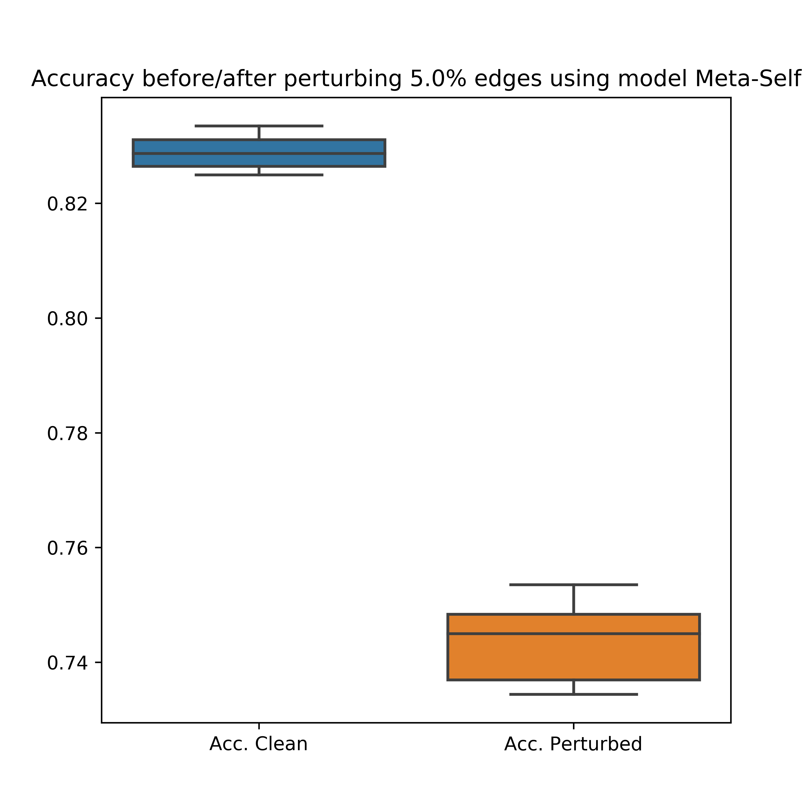
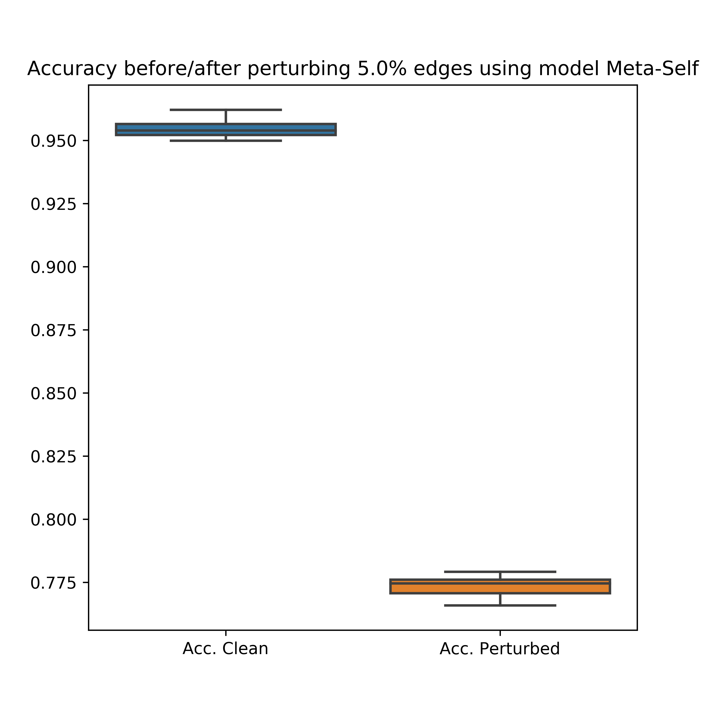

# pytorch-gnn-meta-attack
pytorch implementation of gnn meta attack (mettack). This repository is the pytorch implementation of the graph attack paper:
[Adversarial Attacks on Graph Neural Networks via Meta Learning](https://openreview.net/pdf?id=Bylnx209YX)

Tensorflow implementation can be found [here](https://github.com/danielzuegner/gnn-meta-attack)

**This method is included in [DeepRobust](https://github.com/DSE-MSU/DeepRobust), a very easy-to-use PyTorch Attack/Defense Library.**

## Requirements
* Python 3.6 or newer
* numpy
* scipy
* scikit-learn
* pytorch 1.0 or newer
* matplotlib (for plotting the results)
* seaborn (for plotting the results)

## Usage
To test the model, use the following command

`python test_metattack.py`

You can also add some additional configs

`python test_metattack.py --dataset cora --ptb_rate 0.05 --model Meta-Self`

## The results on three datasets:

Cora            |  Citeseer | Polblogs
:-------------------------:|:-------------------------:|:-------------------------:
  |  |
