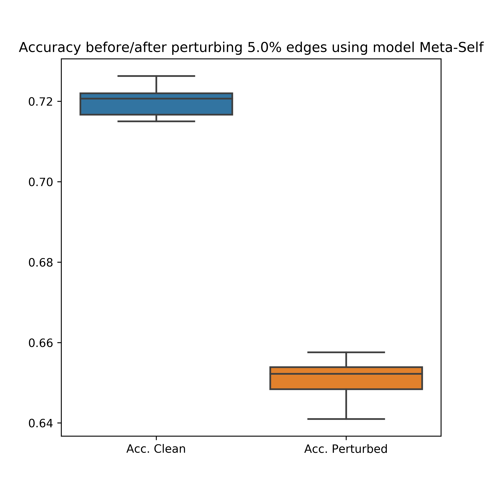

# pytorch-gnn-meta-attack
pytorch implementation of gnn meta attack (mettack)

Implementation of the paper:
[Adversarial Attacks on Graph Neural Networks via Meta Learning](https://openreview.net/pdf?id=Bylnx209YX)

Tensorflow implementation can be found [here](https://github.com/danielzuegner/gnn-meta-attack)

## Usage
To test the model, use the following command

`python test_mettack.py`

You can also add some additional configs

`python test_mettack.py --dataset cora --ptb_rate 0.05 --model Meta-Self`

## The results on three datasets:

Cora            |  Citeseer | Polbogs
:-------------------------:|:-------------------------:|:-------------------------:
  |  |
